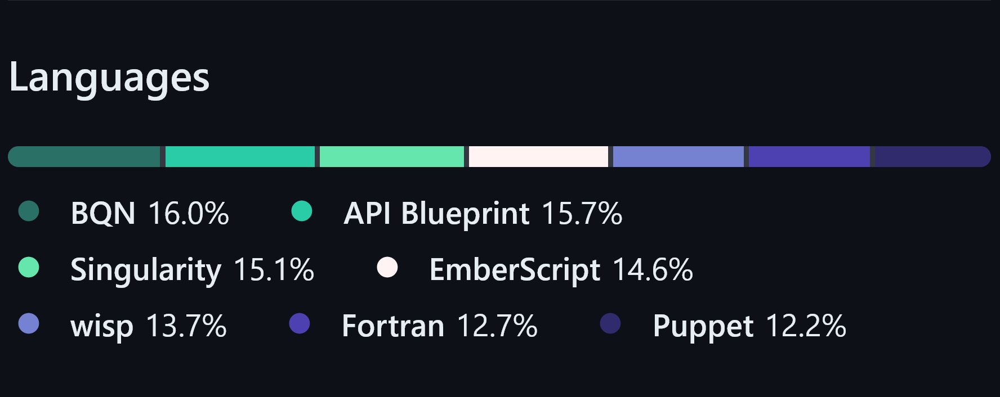

# Gay MLM Pride in GitHub Repository Languages

Just in case github changes any of the colors,
this is what it's supposed to look like:

Here is the flag which inspired this: [New Gay Pride Flag](https://commons.wikimedia.org/wiki/File:New_Gay_Pride_Flag.svg)

## Similar projects

This repository has been inspired by various other Pride flags

- https://github.com/spacekookie/gay
- https://github.com/ticky/trans
- https://github.com/alexwlchan/asexual
- https://github.com/TartanLlama/non-binary
- https://github.com/issyl0/pan
- https://github.com/mattbischoff/bisexual
